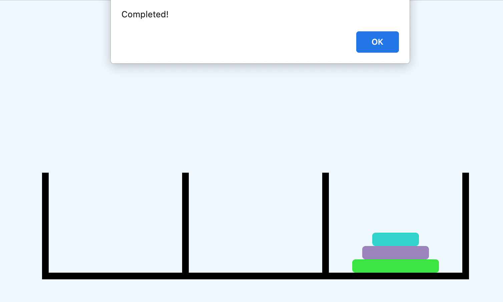

### Tower of Hanoi, Stack the towers smallest (top) to largest (bottom) in last column!

### Technologies used

- HTML
- CSS
- JavaScript

### Installation Instructions

- For and clone the repository
- cd to the name of the repo: Tower-of-Hanoi
- Open in your preferred text editor
- Open index.html in your browser

### Who are the users, what do they want and why?

## User Stories:

- As a player, I want to learn about the game so I can increase my puzzle solving skills
- As a player, I want to see how well I solve puzzles
- As a player, I want a challenging thought provoking puzzle game
- As a player, I want to be able to get in a quick mind challenge

## Who are the users:

- Anyone who loves playing with advanced puzzles
- Has a desire for a challenge that involves thinking
- Has either computer, tablet, or smart phone

### Wireframes

### Improvements and Road Blocks

### Improvements

- Get my multiple discs to be playable without bugs and glitches
- Have my game reset with every add of a discs
- I want to make my code less complex and with more comments
- Pseudo code a lot more and spend way more time planning
- Organize things into smaller and more functions than couple big ones

### Road Blocks

- Lack of planning and making pseudo code.
- Pacing the work out into blocks, rather than binging the work.
- DOM Manipulation regarding the game play and win condition.

### Bronze

- Adding in a night mode
### Silver

- Timer 
### Gold

- Adding in win condition with multiple discs
- Adding in logic with multiple discs, and reseting game board when adding discs 
- Beat the clock version
